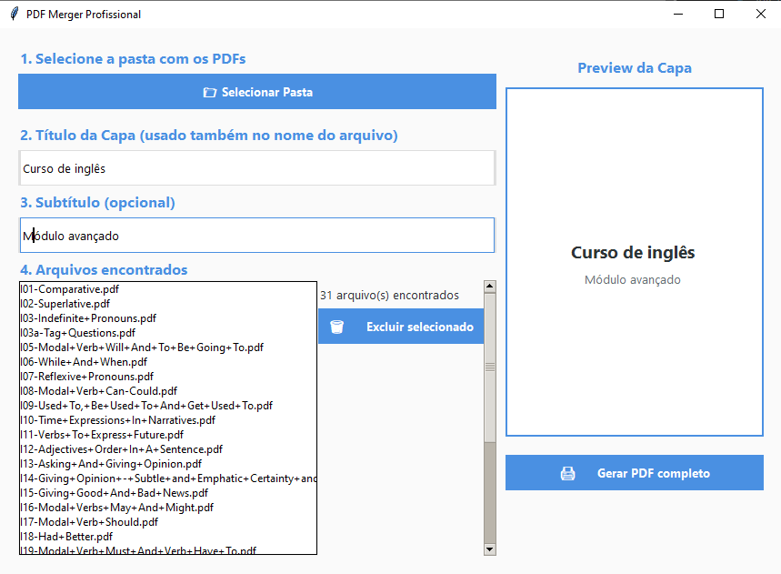

# 📄 PDF Merger Tool

Ferramenta moderna, prática e visual para combinar múltiplos PDFs em um único documento profissional — com **capa personalizada**, **sumário automático** e **numeração de páginas**.  

Criada com carinho por um engenheiro de software para facilitar o dia a dia de **professores**, **estudantes** e **desenvolvedores** que valorizam **organização** e **produtividade**.  



---

## ✅ Funcionalidades

- 📂 Seleção automática de múltiplos arquivos PDF (ordenados alfabeticamente)
- 🧾 Geração de **capa personalizada** com título e subtítulo
- 📑 Criação de **sumário automático** baseado nos nomes dos arquivos
- 🔢 **Numeração sequencial** das páginas no PDF final
- ❌ Remoção de numeração antiga dos PDFs originais
- 🖥️ Interface gráfica amigável com **pré-visualização da capa**

---

## 👤 Para Usuários Finais

### 🔽 Como Baixar e Usar

👉 [Clique aqui para baixar o executável (.exe)](https://github.com/dhionson2/pdf-merger-tool/releases/download/V1/PDFMergerTool.exe)

**✅ Não precisa instalar nada.**  
🖥️ Compatível com **Windows 10/11**  
📦 Totalmente portátil — basta abrir e usar!

---

## 👨‍💻 Para Desenvolvedores

### 🔧 Requisitos

- Python **3.10** ou superior
- Instale as dependências com:

```bash
pip install -r requirements.txt


▶️ Executar Localmente

python -m src.gui


🛠️ Gerar Executável (.exe) com PyInstaller (opcional)

pyinstaller --onefile --noconsole main.py --name PDFMergerTool


🪪 Licença
Este projeto está sob a Licença MIT.
Você é livre para usar, modificar e distribuir — desde que mantenha os devidos créditos.


💬 Contribuições
Contribuições são muito bem-vindas!
Sinta-se à vontade para abrir issues, sugerir melhorias ou enviar pull requests.

Vamos construir juntos uma ferramenta cada vez mais útil! 💡🚀

**Criado por [Dhionson Plaster Moreira](https://github.com/dhionson2)** 👨‍💻


